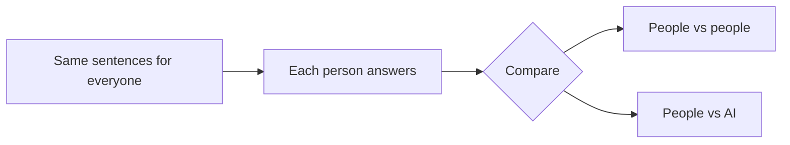
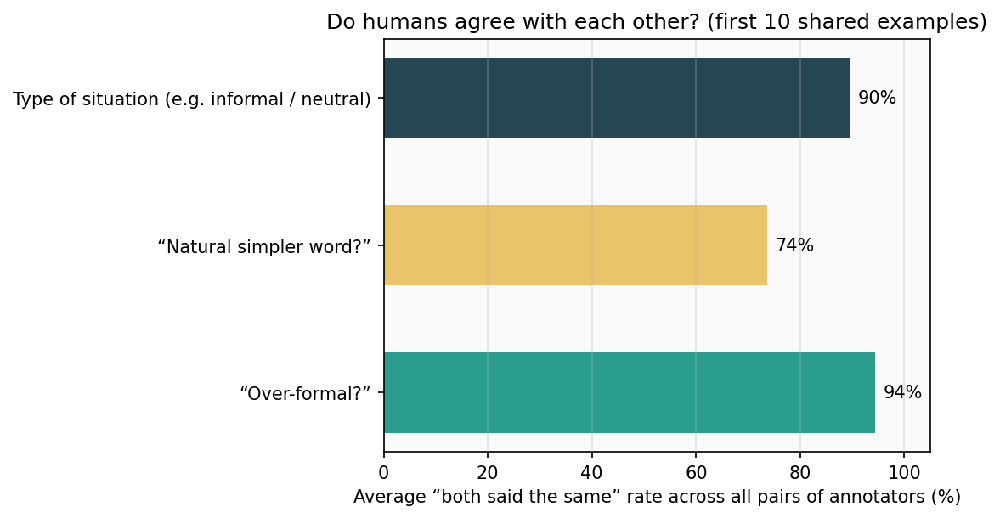
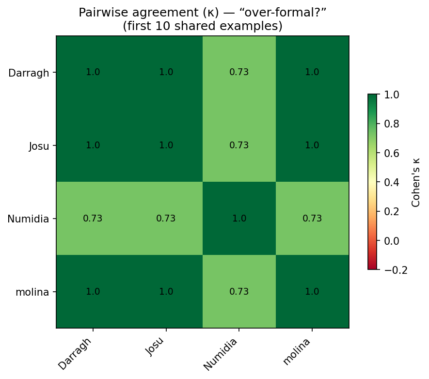
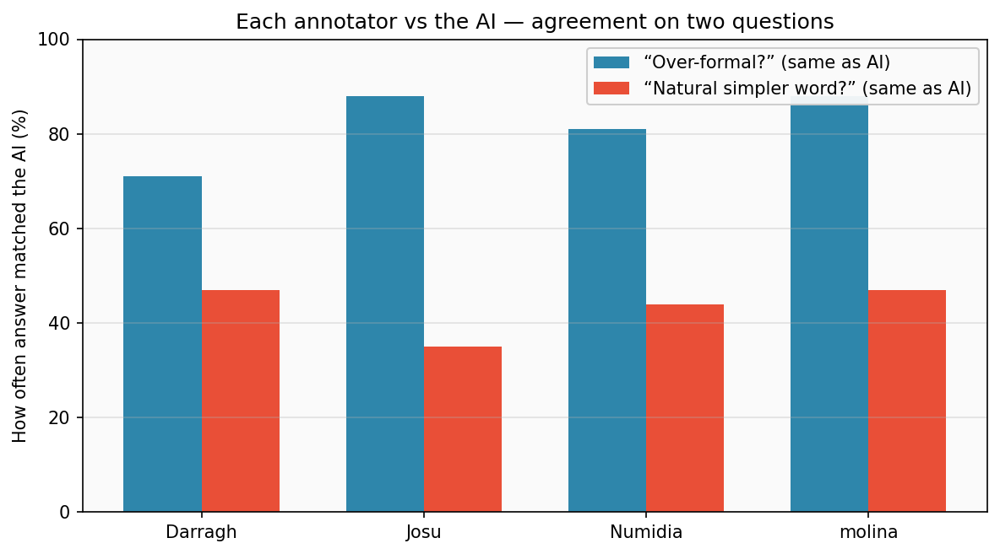
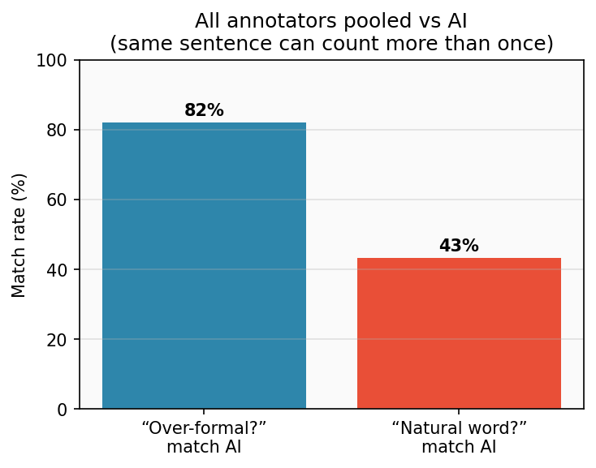
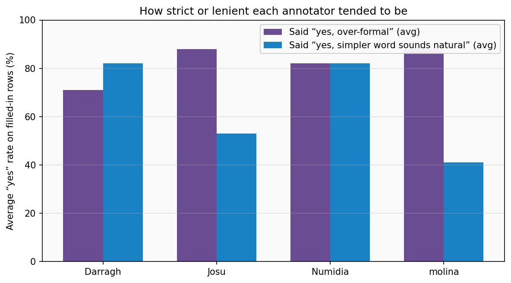
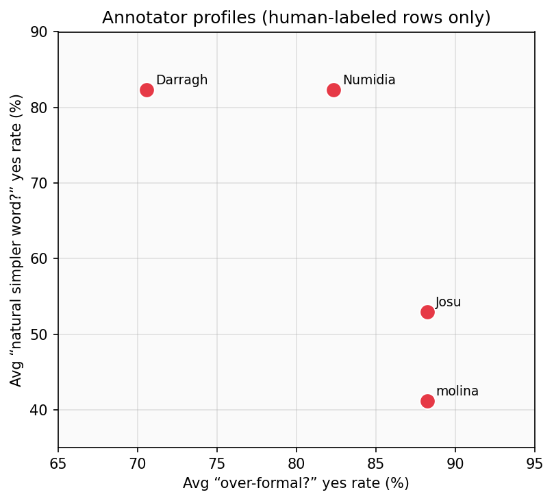
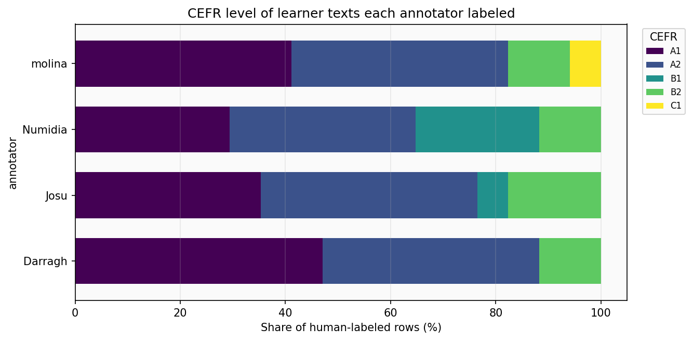
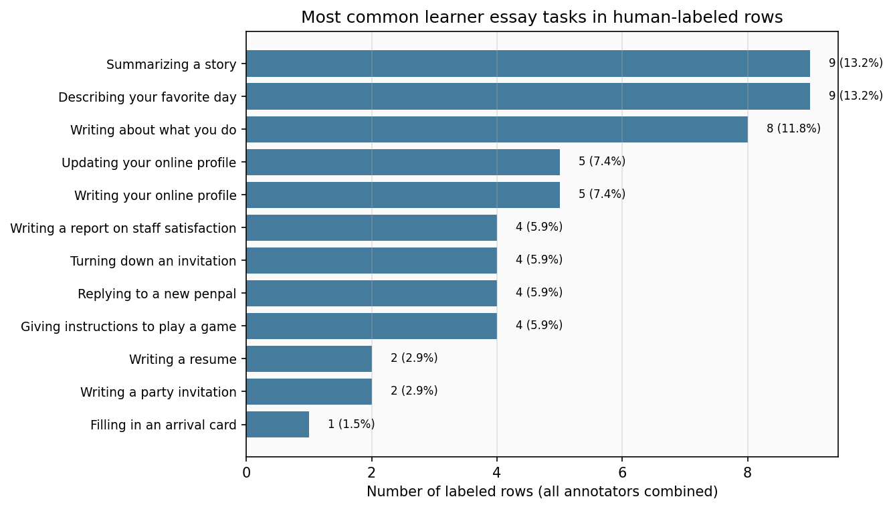
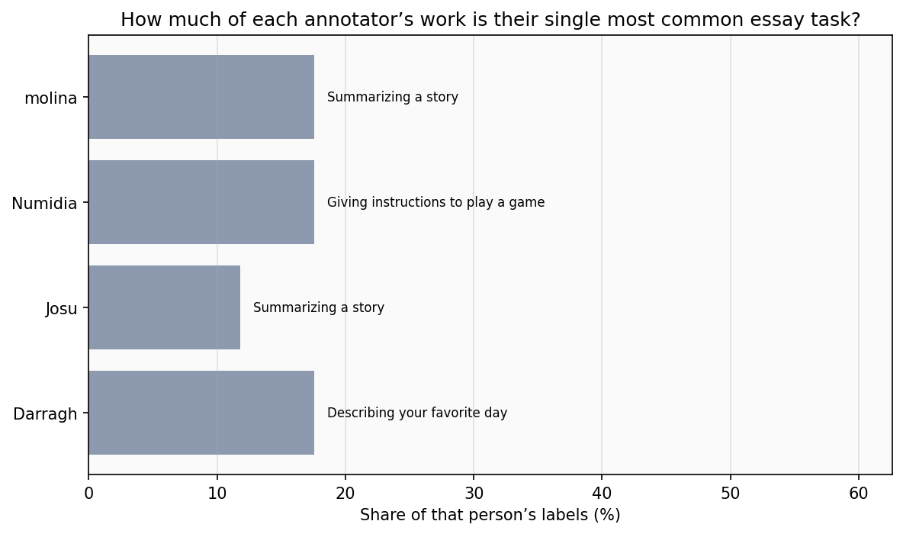

# Annotation results — plain-English summary

**What this is:** Four people each checked the same learner sentences and answered short questions (e.g. *Is the fancy word out of place?*). We compared **people to each other** and **people to the AI** that had pre-filled suggestions.

**Bottom line**

- On a small shared set of examples, people **mostly agreed** on whether a word felt “too formal” for the situation.
- They **disagreed more** on a trickier question: whether the suggested simpler word sounded natural.
- The AI almost always marked examples as “over-formal,” so **match rates** with humans are useful; a fancy “agreement score” (kappa) isn’t meaningful for that question.
- On “natural simpler word,” **people and the AI often disagreed** — treat the AI’s answer here as **weak** unless you refine the instructions or the model.

---

## How the check worked (simple picture)



---

## 1. Do the humans agree with each other?

We used the **first 10 examples** from the master list (everyone had those in their file).

**Figure — average “same answer” rate between any two people**



**Figure — deeper view: pairwise agreement scores (κ) for “over-formal?”**  
*(1.0 = perfect match; green is stronger agreement.)*



**In words**

| Topic | What it means | Typical match between two people |
|--------|----------------|----------------------------------|
| **“Over-formal?”** | Is the latinate word *register-marked* for this context? | **Very high** — many pairs matched on every item; where Numidia was involved, still **~89%** (one item sometimes missing for one rater). |
| **“Natural simpler word?”** | Does the suggested Germanic alternative sound natural? | **Mixed** — some pairs **~60%** match, others **100%** on this tiny set. |
| **Type of situation** | Labels like informal / neutral / academic | **Usually high** — often **~80–100%** match depending on the pair. |

---

## 2. Do the humans match the AI?

We looked at rows where **both** a person and the AI had an answer (about **17** rows per person for most sheets; **38** sentences exist in the file in total).

**Figure — how often each person’s answer matched the AI**



**Figure — all human judgments stacked together vs the AI**  
*(The same sentence can appear up to four times, once per annotator.)*



**“Over-formal?” (register)**  
- **Darragh** matched the AI on **~71%** of rows.  
- **Josu** and **molina** matched on **~88%**.  
- **Numidia** matched on **~81%**.  
- **Why we don’t show a “kappa” here:** The AI said “yes, over-formal” on **every** line in this file. When one side never varies, that statistic isn’t informative — **use the percentages above** instead.

**“Natural simpler word?” (substitution)**  
- Matches were **much lower** (**~35–47%**).  
- So for this question, **humans and the AI are often out of step** — not a safe substitute for human judgment without more work.

**All judgments pooled together** (same sentence can count up to four times):  
- **~83%** same as AI on “over-formal?”  
- **~43%** same on “natural simpler word?”

---

## 3. Did some people answer “yes” more often than others?

This is **not** good or bad — it shows **different thresholds** on the same scale.

**Figure — average “yes” rates on rows each person actually filled in**



**Figure — same idea as a simple scatter (each dot is one annotator)**



- **Darragh** said “over-formal” **less often** (~71% of filled rows) but was **more willing** to say the simpler word sounded natural (~82%).  
- **Josu** and **molina** said “over-formal” **more often** (~88%); **molina** was **least** likely to say the simpler word sounded natural (~41%).  
- **Numidia** was in the **middle** on “over-formal” (~82%) and **similar to Darragh** on naturalness (~82%).

**About the learners in these rows**  
The texts are mostly **French** native speakers, nationality **fr**, with **A1/A2** levels common — that describes the **data**, not the annotators.

**Figure — CEFR band mix of the rows each person labeled**



**About the AI row in the spreadsheet**  
On this file the AI always marked register as “over-formal” and was **moderately often** positive on substitution naturalness — useful as context, not as ground truth.

---

## 4. What kinds of learner essays were people labeling?

Each row has an **essay task** label (e.g. *Summarizing a story*). These are **categories**, not numbers — there is **no meaningful “average topic.”**  
Instead we report:

- **Most common task** for each annotator’s labeled rows (the **mode**).  
- **How spread out** their tasks were (counts and percentages in the spreadsheet).

**Figure — most common tasks when we pool everyone’s human-labeled rows**



**Figure — how concentrated each person’s work was on their own top task**



**Typical task (most common) on each person’s 17 labeled rows** (from the latest run):

| Annotator | Most common essay task | Share of that person’s labels |
|-----------|-------------------------|-------------------------------|
| Darragh | Describing your favorite day | ~18% |
| Josu | Summarizing a story | ~12% |
| Numidia | Giving instructions to play a game | ~18% |
| molina | Summarizing a story | ~18% |

Across **all** labeled rows pooled, tasks are **spread across many prompts** — no single task dominates; see `metrics/group_essay_topics_pooled.csv` for the full list.

---

## 5. What to be careful about

- **Only ~10 examples** for the human-vs-human summary — good for a **pilot**, not the final word on reliability.  
- **Not every row is filled** yet (~17 human-completed rows vs 38 in the list).  
- **Pooled** human-vs-AI numbers **count the same sentence multiple times** if four people judged it — fine for “overall workload vs model,” not for “independent sentences.”

---

## 6. Repo housekeeping (delete anything?)

- **Nothing has to be deleted** for the analytics to work.  
- **Optional:** If you uploaded the same annotation file twice under different names (e.g. in `annotation/Group_annotations/`), you can remove duplicates **only if** you are sure you don’t need them.  
- **Do not commit** huge raw spreadsheets under `data/raw/` — they are **gitignored** on purpose (GitHub’s size limit).

---

## 7. Update the numbers and charts

From the project folder:

```bash
python analytics/group_annotation_agreement.py   # tables in metrics/
python analytics/render_group_annotation_figures.py   # images in docs/figures/
```

Spreadsheet outputs include agreement stats **and** topic / CEFR breakdowns. Technical column definitions: `metrics/GROUP_ANNOTATION_README.md`.
