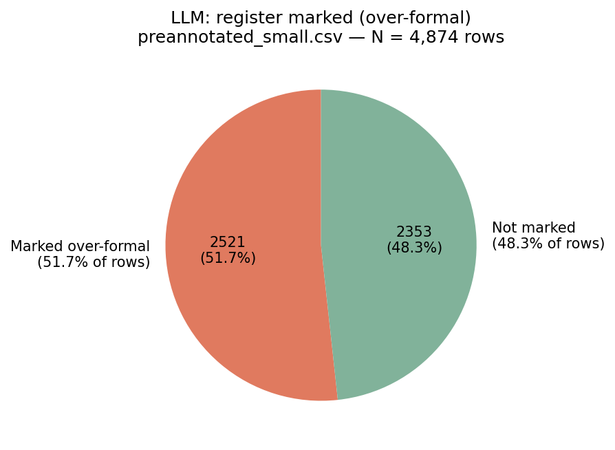
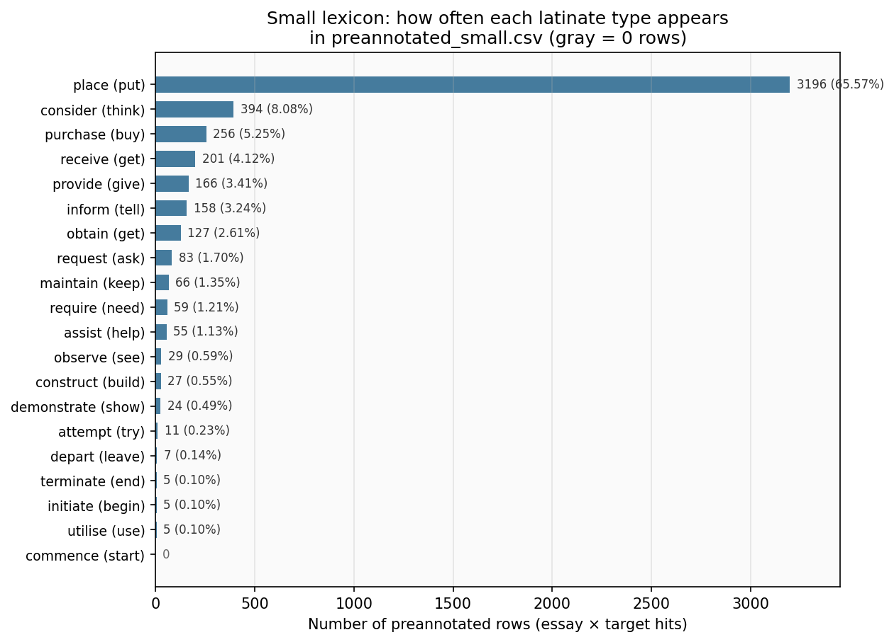
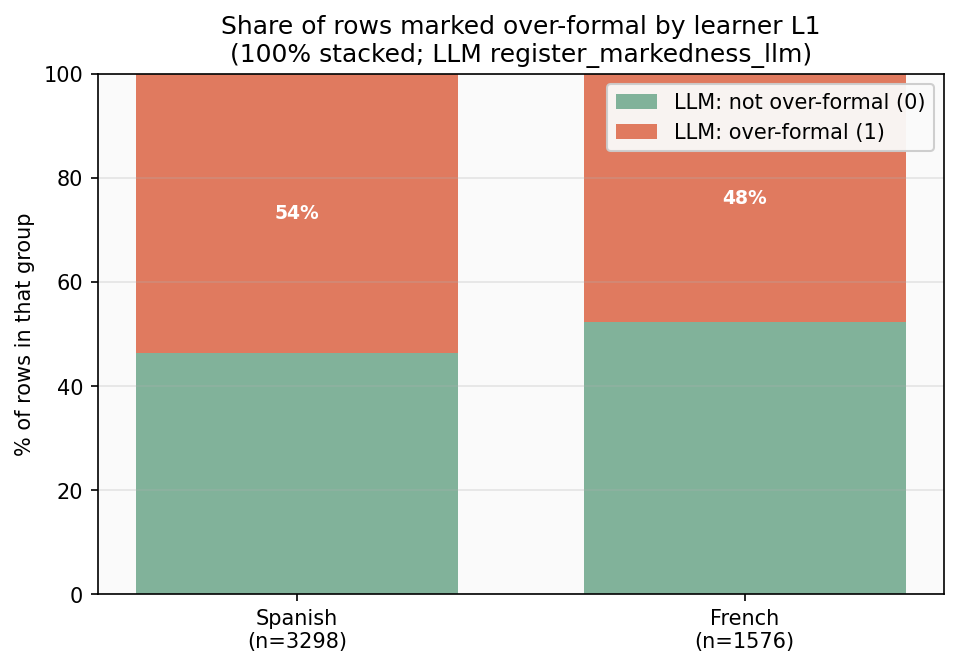
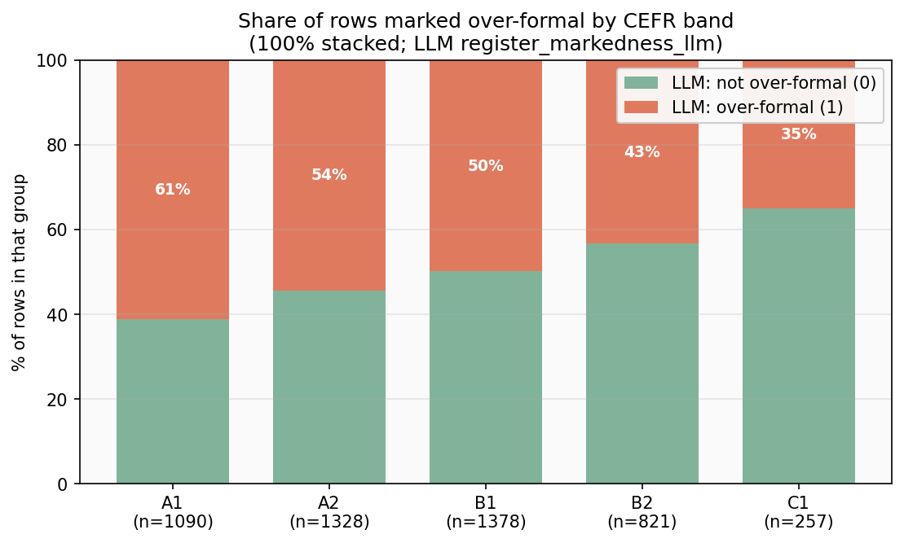
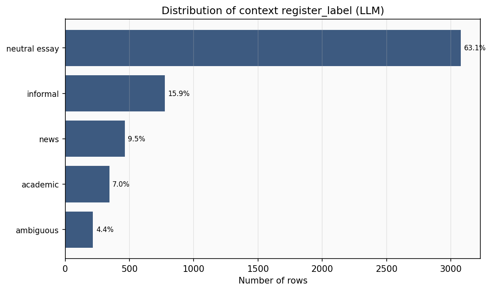
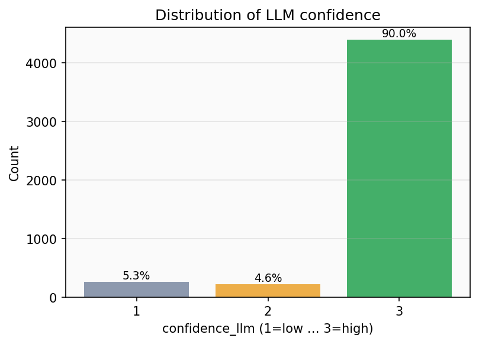
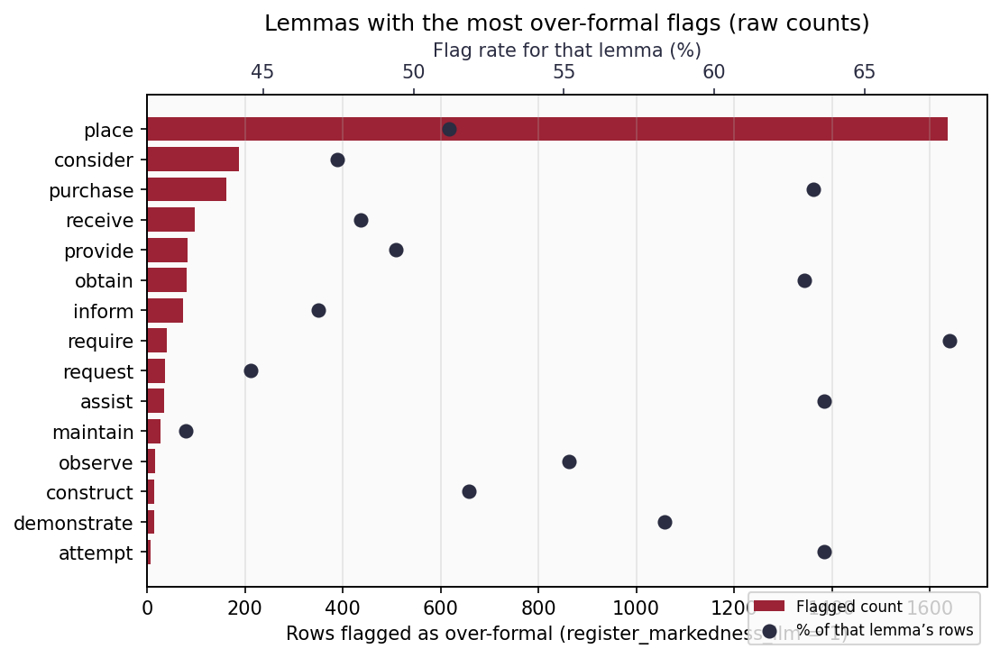
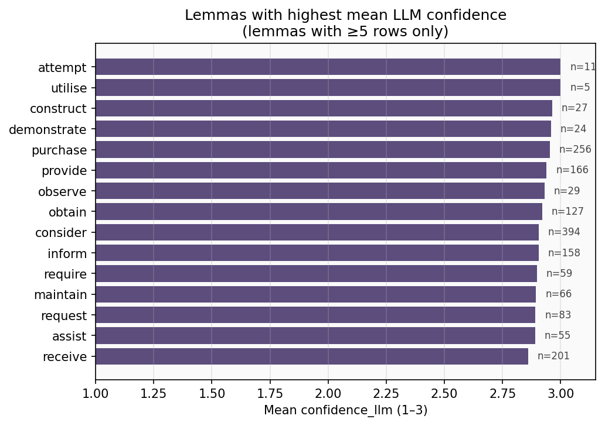

# LLM pre-annotation profile: `preannotated_small.csv`

This page summarises **Mistral (via Ollama)** outputs on the full small-lexicon candidate pool **before** you thin it to the human file `preannotated_small_conf2plus.csv`.

**Regenerate numbers and plots:**

```bash
python analytics/preannotated_small_profile.py
python analytics/render_preannotated_small_profile_figures.py
```

Metrics tables live in `metrics/preannotated_small_*.csv`.  
Lexicon-only counts: `metrics/preannotated_small_lexicon_token_counts.csv`.  
L1 / CEFR vs over-formal: `metrics/preannotated_small_l1_by_overformal.csv`, `metrics/preannotated_small_cefr_by_overformal.csv`.

---

## 1. Share flagged as over-formal

The model sets **`register_markedness_llm = 1`** when it judges the latinate **target** is register-marked (too formal) for the sentence context.

**Current run (example):** about **52%** of rows are marked over-formal (**~2,521 / 4,874**). The rest are **not** marked (**~48%**).

That split is **not** “always yes” — it reflects the full candidate set. (The smaller **conf2+** human sheet can look different because you **re-sample** per lemma with tier rules.)



---

## 2. Small lexicon: distribution of row counts per latinate token

Each row in `preannotated_small.csv` is one **(essay, latinate target)** pair after corpus filtering. The **20 latinate types** from `Small_seed_lexicon.csv` are **not equally frequent**: tokenisation + learner usage means some lemmas appear in many more hits than others.

**Current run:** **`place`** accounts for most rows (**~66%** of the file); **`consider`**, **`purchase`**, **`receive`**, etc. form a long tail; **`commence`** has **0** rows here (no surface-form hit in the sampled corpus for that lemma under the current matcher).

The plot lists **latinate (germanic pair)**; grey bars are **zero** hits.



---

## 3. L1 and proficiency level vs “over-formal” (LLM)

For each **learner L1** and each **CEFR band**, we show what **share** of rows the LLM flagged as **register-marked / over-formal** (`register_markedness_llm = 1`). Bars are **100% stacked** so you can compare rates even when group sizes differ; **n** under each label is the number of preannotated rows in that group.

Tables: `metrics/preannotated_small_l1_by_overformal.csv`, `metrics/preannotated_small_cefr_by_overformal.csv`.

**Current run (example):** Spanish L1 rows are slightly **more often** marked over-formal than French in this pool; by level, **A1** has the **highest** share marked over-formal, **C1** the **lowest** — consistent with more formal/accurate production at higher levels (and/or model behaviour).





---

## 4. Distribution of `register_label`

`register_label` is the model’s guess at the **overall tone** of the passage (not only the target word).

**Current run:** most rows are **`neutral essay`** (~**63%**), then **`informal`** (~**16%**), **`news`** (~**10%**), **`academic`** (~**7%**), **`ambiguous`** (~**4%**).

That matches learner–essay–style data: a lot of middle-register student writing.



---

## 5. Distribution of `confidence_llm`

Scale: **1 = low**, **2 = medium**, **3 = high**.

**Current run:** **~90%** of rows are confidence **3**, **~5%** each for **1** and **2**. So the model is **very often “sure”** on this task — useful for filtering, but it also means confidence **does not separate** rows as strongly as you might want for quality control.



---

## 6. Which lemmas are flagged most often?

Two views (both in `metrics/preannotated_small_lemma_stats.csv`):

- **Raw counts:** lemmas that appear in **many** candidate rows and accumulate many flags (e.g. high-frequency targets in the corpus).
- **Flag rate (%):** among lemmas with enough rows (e.g. **≥5**), which are **most often** marked over-formal.

**Current run — most flags by count:** **`place`** dominates the table because it has the **largest n** in this file; **`consider`**, **`purchase`**, **`receive`**, etc. follow.

**High flag rate (examples):** lemmas such as **`require`**, **`assist`**, **`purchase`**, **`obtain`** often sit toward the top by **pct_flagged** (exact order depends on the run).



---

## 7. Which lemmas have the highest confidence?

We rank by **mean `confidence_llm`**, restricting to lemmas with **≥5 rows** so tiny samples don’t rank first by chance.

**Current run:** several lemmas hit **mean ≈ 3.0** (e.g. **`utilise`**, **`attempt`** with small **n**; **`purchase`**, **`provide`**, **`inform`** among larger **n**). See `metrics/preannotated_small_lemmas_top_mean_confidence.csv` for the exact table.



---

## 8. How to read this next to human annotation

- These stats describe the **full preannotated pool**, not the **38-row** human sample.
- If humans disagree a lot with the LLM on register, check whether the model was **over-confident** (many 3s) or **biased** toward one `register_label` bucket.
- For methods text: cite **N rows**, **% over-formal**, **confidence mix**, and **lemma-level** tables from `metrics/`.
